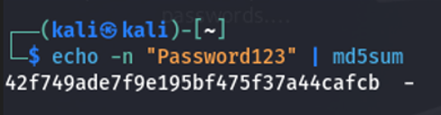
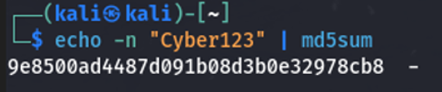
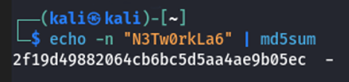
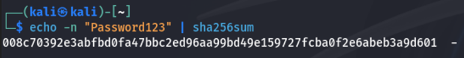
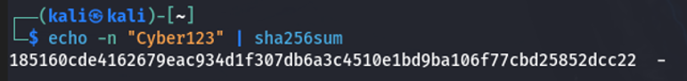
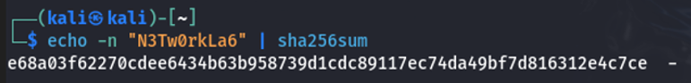
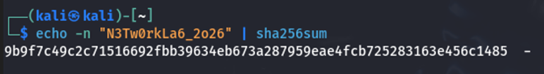

# MD5 vs SHA-256 in Kali Linux

> Hands-on cryptographic hashing lab using Kali Linux demonstrating MD5 vs SHA-256 with real command-line execution and security analysis.

## Overview
This project demonstrates the practical use of cryptographic hash functions in Kali Linux, focusing on MD5 and SHA-256.

The project also connects the practical lab execution to theoretical concepts of:
- Determinism  
- Fixed-length output  
- Avalanche effect  
- Algorithm strength  
- Security implications of legacy hashing algorithms  

---

## Objectives
1. Generate MD5 hashes for selected plaintext values  
2. Generate SHA-256 hashes for the same values  
3. Observe how input changes affect output  
4. Compare MD5 vs SHA-256 security  
5. Support theory with real execution  

---

## Tools and Environment
- **Operating System:** Kali Linux  
- **Shell:** Bash  
- **Commands Used:** `md5sum`, `sha256sum`  

---

## MD5 Hash Generation
```bash
echo -n "Password123" | md5sum
echo -n "Cyber123" | md5sum
echo -n "N3Tw0rkLa6" | md5sum
```

---

## SHA-256 Hash Generation
```bash
echo -n "Password123" | sha256sum
echo -n "Cyber123" | sha256sum
echo -n "N3Tw0rkLa6" | sha256sum
echo -n "N3Tw0rkLa6_2026" | sha256sum
```

**Note:** The `-n` flag prevents adding a newline.

---

## Results

### MD5 Hash Outputs
| Input        | MD5 Hash                              |
|-------------|----------------------------------------|
| Password123 | 42f749ade7f9e195bf475f37a44cafcb       |
| Cyber123    | 9e8500ad4487d091b08d3b0e32978cb8       |
| N3Tw0rkLa6  | 2f19d49882064cb6bc5d5aa4ae9b05ec       |

---

### SHA-256 Hash Outputs
| Input              | SHA-256 Hash                                                                 |
|-------------------|------------------------------------------------------------------------------|
| Password123       | 008c70392e3abfbd0fa47bbc2ed96aa99bd49e159727fcba0f2e6abeb3a9d601             |
| Cyber123          | 185160cde4162679eac934d1f307db6a3c4510e1bd9ba106f77cbd25852dcc22             |
| N3Tw0rkLa6        | e68a03f62270cdee6434b63b958739d1cdc89117ec74da49bf7d816312e4c7ce             |
| N3Tw0rkLa6_2026   | 9b9f7c49c2c71516692fbb39634eb673a287959eae4fcb725283163e456c1485             |

---

## Key Observations
- Same input → same hash (**determinism**)  
- Output length is constant  
- Small changes → completely different hash (**avalanche effect**)  
- MD5 is fast but insecure  
- SHA-256 is stronger and widely used  

---

## Security Analysis

### MD5 Weaknesses
- Vulnerable to collision attacks  
- Cracked using rainbow tables  
- Fast → easier brute force  

### SHA-256 Strengths
- Strong collision resistance  
- Used in TLS, blockchain, etc.  
- Still secure today  

**Note:** Use bcrypt, scrypt, or Argon2 for password storage.

---

## Lab Execution Screenshots

### MD5 Execution




---

### SHA-256 Execution





---

## Repository Structure
```
README.md
images/
report/
```

---

## Author
Vivek Ahir

---

## License
This project is for educational and portfolio purposes.
